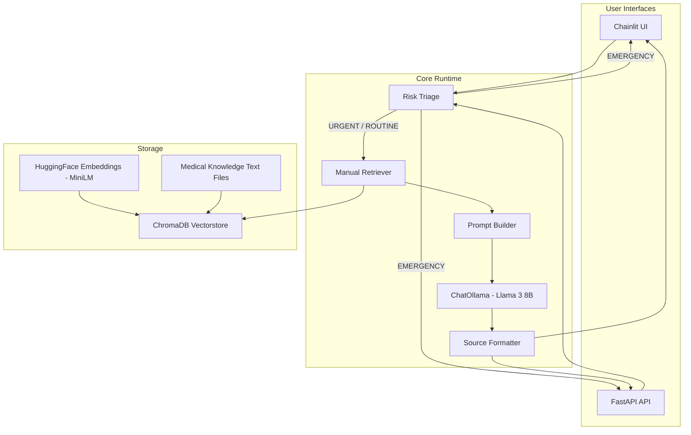

# AI Healthcare Chatbot - Architecture Walkthrough

## Project Overview

This is a **medical decision-support chatbot** with the following core capabilities:
- **RAG-style retrieval** over curated medical knowledge texts
- **Multi-turn conversation** with session-based history
- **Deterministic emergency detection** with immediate safety routing
- **Source citation** for every grounded response
- **Offline operation** using a local LLM (Ollama / Llama 3) and CPU embeddings

---

## High-Level Architecture



---

## Data Flow (Per Request)

```text
User Input -> Chainlit on_message() or POST /chat
                    |
                    v
          1. assess_risk_level(history + user_input)
                    |
         +----------+-----------+
         |                      |
         | EMERGENCY            | URGENT / ROUTINE
         v                      v
 get_emergency_response()   2. Load conversation history
         |                      |
         |                      v
         |             3. Retrieve documents with
         |                vectorstore.as_retriever()
         |                      |
         |                      v
         |             4. Build guarded system prompt
         |                + turn strategy + history
         |                      |
         |                      v
         |             5. await llm.ainvoke(messages)
         |                      |
         |                      v
         |             6. Apply fallback & over-reassurance guardrails
         |                + inject deterministic safety notices
         |                + format_sources(docs)
         |                      |
         +----------------------+ 
                                v
                     7. Return response to UI / API
```

---

## Core Components

### 1. Chainlit Application ([src/ui/app.py](../src/ui/app.py))

The Chainlit entry point is the primary interactive UI. It manages per-session chat history and delegates all medical logic to [src/core/logic.py](../src/core/logic.py).

**Handlers:**
- `on_chat_start()` initializes shared components and creates an empty `chat_history` list in `cl.user_session`
- `on_message()` forwards the user message and session history to `process_chat_message()`

### 2. FastAPI Application ([run_api.py](../run_api.py) -> [src/api/main.py](../src/api/main.py))

The API exposes the same backend through REST endpoints:
- `GET /health`
- `POST /chat`

Both the API and Chainlit UI share the same core runtime, so behavior stays consistent across interfaces.

### 3. Core Chat Logic ([src/core/logic.py](../src/core/logic.py))

This is the active orchestration layer for the chatbot.

**Important functions:**
- `initialize_components()` loads the embedding function, vectorstore, and LLM singletons
- `process_chat_message()` performs triage, retrieval, prompt construction, LLM invocation, fallback handling, and source formatting
- `_detect_triage_phase()` categorizes the conversation into one of four phases (`INITIAL_SCREENING`, `CHARACTERIZATION`, `DIFFERENTIAL`, `URGENT_ASSESSMENT`)
- `_check_sufficiency()` uses regex to detect if onset, severity, red-flags, and context have been addressed
- `get_triage_strategy()` adapts the system prompt to force the LLM to ask targeted questions about missing sufficiency markers
- `build_medical_context_section()` keeps retrieved context compact and sentence-safe
- `format_sources()` converts retrieved document metadata into a citation string

**Deterministic Safety Injection:**
- If the conversation reaches the `DIFFERENTIAL` phase but the user never explicitly addressed red flags, the system *deterministically* injects a safety notice into the final LLM response.
- An **Over-Reassurance Guard** scans the final LLM output for dismissive phrases (e.g., "nothing to worry about") and replaces them with professional, cautious alternatives.

**Key design choice:**
- The project uses **manual retrieval and prompt assembly**, not a LangChain retrieval chain at runtime

### 4. Risk Engine ([src/core/risk.py](../src/core/risk.py))

The risk module is intentionally **pure stdlib** and deterministic.

**Behavior:**
- `assess_risk_level()` aggregates the **entire conversation history** plus the current input to calculate risk. This ensures critical symptoms mentioned in Turn 1 are never forgotten in later turns.
- Uses `_strip_negated_phrases()` to prevent false-positive risk escalation (e.g., "No chest pain" correctly scores 0).
- Returns `EMERGENCY`, `URGENT`, or `ROUTINE`.
- `get_emergency_response()` returns the hard-stop safety message.
- EMERGENCY inputs bypass retrieval and LLM inference entirely.

### 5. Vectorstore Service ([src/services/vectorstore.py](../src/services/vectorstore.py))

This module manages the persistent ChromaDB store.

**Responsibilities:**
- Load an existing vectorstore from `CHROMA_PERSIST_DIR`
- Validate it with a lightweight test query
- Rebuild it from the knowledge text files if missing or invalid

### 6. LLM Service ([src/services/llm.py](../src/services/llm.py))

This module creates the `ChatOllama` instance used by the runtime.

**Current settings:**
- Model: `llama3:8b`
- Temperature: `0.3`

### 7. Data Ingestion Script ([scripts/ingest_data.py](../scripts/ingest_data.py))

This script prepares the knowledge base inputs used by the runtime.

**What it does:**
- Downloads / processes the configured medical datasets
- Writes normalized, safety-filtered text files into `data/`
- Deletes the configured `CHROMA_PERSIST_DIR` so the next app start recreates the vectorstore from fresh text data

**What it does not do:**
- It does **not** directly build the ChromaDB collection itself; that happens lazily in `load_or_create_vectorstore()`

---

## User Interface

### Chainlit UI

The Chainlit interface is built directly into [src/ui/app.py](../src/ui/app.py).

**Features:**
- Real-time chat interface
- Automatic per-session state via `cl.user_session`
- Welcome message and usage guidance
- Source citations appended to grounded answers

**Session state:**
- `chat_history` stores the recent `HumanMessage` / `AIMessage` turns for that user session

**Process-wide shared state:**
- Embedding model
- Chroma vectorstore
- ChatOllama model

---

## Data Files

| File | Purpose |
|------|---------|
| [medical_knowledge_medmcqa.txt](../data/medical_knowledge_medmcqa.txt) | Medical Q&A knowledge derived from MedMCQA |
| [medical_knowledge_medquad.txt](../data/medical_knowledge_medquad.txt) | Medical Q&A knowledge derived from MedQuAD |
| [medical_knowledge_public_health.txt](../data/medical_knowledge_public_health.txt) | Public-health educational knowledge |
| `CHROMA_PERSIST_DIR` | Configurable path to the persistent ChromaDB store; populated lazily by the runtime after the knowledge files exist |

---

## Archived / Legacy Architecture

> [!NOTE]
> The active project no longer uses the old multi-agent / Streamlit architecture. Historical reference material is kept in [docs/archive](archive/) and related legacy notes, but it is **not part of the current runtime**.

The project previously used a multi-process design with components such as:

| Legacy Component | Original Path | Description |
|------------------|---------------|-------------|
| FastAPI Backend | `backend/app.py` | Orchestration API with `/orchestrate` |
| Streamlit Frontend | `frontend/streamlit_app.py` | Multi-page UI |
| Agent Layer | `src/chatbot_system/` | SymptomAgent, DiagnosisAgent, FollowUpManager, RecommendationAgent |
| Safety Router | `backend/safety_router.py` | Input pre-validation and routing |
| Clean Architecture | `app/` | DDD-style application layers |
| BioMistral Provider | `app/infrastructure/ai/llm_provider.py` | GGUF-based LLM provider |
| ML Pipeline | `.joblib` models | TF-IDF + Logistic Regression scoring |

For the archived defense writeup, see [docs/archive/ARCHIVED_VIVA_DEFENSE_DOCUMENT.md](archive/ARCHIVED_VIVA_DEFENSE_DOCUMENT.md).

---

## LLM Integration

### ChatOllama - Llama 3 8B ([src/services/llm.py](../src/services/llm.py))

- Served locally through **Ollama**
- Model name comes from `LLM_MODEL`
- Configured conservatively for medical education use
- Embeddings use `all-MiniLM-L6-v2` on CPU

---

## Testing Structure

```text
tests/
|- conftest.py                    # Pytest fixtures & helpers
|- test_api_connection.py         # API endpoint tests (FastAPI TestClient)
|- test_context_building.py       # RAG context building tests
|- test_conversation_logic.py     # Multi-turn conversation flow tests
|- test_emergency_detection.py    # Emergency keyword detection tests
|- test_process_chat_message.py   # Full pipeline integration tests
|- test_prompt_logic.py           # Prompt construction & language tests
|- test_risk_scoring.py           # Risk score calculation tests
|- test_safety_filter.py          # Safety / injection filter tests
|- test_source_formatting.py      # Source citation formatting tests
`- test_text_processing.py        # Text normalization & cleaning tests
```

Run with: `pytest tests/`

---

## Key Configuration

| Setting | Location | Purpose |
|---------|----------|---------|
| `CHROMA_PERSIST_DIR` | `src/core/config.py` / `.env` | Persistent ChromaDB path |
| `LLM_MODEL` | `src/core/config.py` / `.env` | Ollama model name |
| `EMBEDDING_MODEL` | `src/core/config.py` / `.env` | HuggingFace embedding model |
| `RETRIEVER_K` | `src/core/config.py` / `.env` | Maximum retrieved documents |
| `RETRIEVER_SCORE_THRESHOLD` | `src/core/config.py` / `.env` | Similarity threshold |
| `CONTEXT_CHAR_LIMIT_PER_DOC` | `src/core/config.py` / `.env` | Per-document context truncation |

---

## Note: Manual Retrieval vs. Retrieval Chain

The active codebase uses **manual retrieval only**. [src/core/logic.py](../src/core/logic.py) calls the retriever directly and builds a custom `messages` list for `llm.ainvoke(...)`.

| Aspect | History-Aware Retrieval Chain | Manual Retrieval (active) |
|--------|-------------------------------|---------------------------|
| **Purpose** | Possible future option | Current implementation |
| **Status** | Not present in runtime code | Used for every chat request |
| **Reason** | N/A | Better control over prompting, fallback behavior, and local-model guardrails |

This is a deliberate choice: the local 8B model benefits from tighter prompt control and explicit echo/fallback protections.

---

## Running the Application

```bash
# 1. Rebuild the knowledge text files
python scripts/ingest_data.py

# 2. Start the chatbot UI
python run_app.py
```

> [!TIP]
> If the configured `CHROMA_PERSIST_DIR` does not exist, the runtime recreates it automatically on first startup from the prepared knowledge text files.
