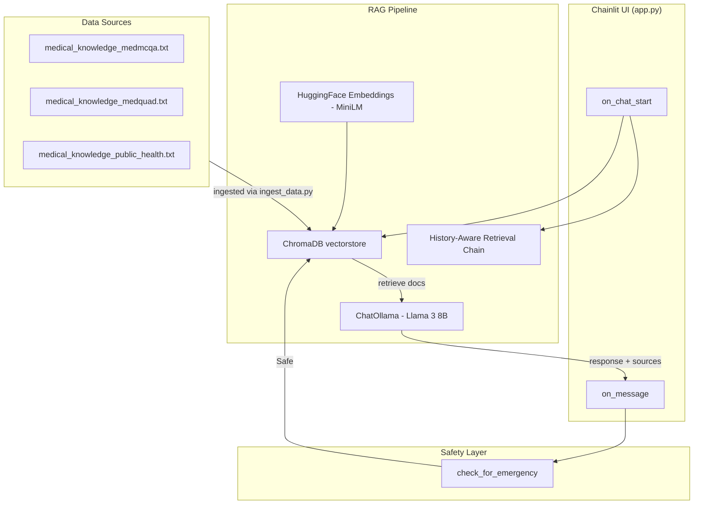

# AI Healthcare Chatbot - Architecture Walkthrough

## Project Overview

This is a **medical decision-support chatbot** with the following core capabilities:
- **RAG-based retrieval** over curated medical knowledge texts
- **Multi-turn conversation** with history-aware context
- **Emergency detection** with immediate safety routing
- **Source citation** for every response
- **Offline operation** using local LLM (Ollama / Llama 3) and CPU embeddings

---

## High-Level Architecture



---

## Data Flow (Per Request)

```
User Input → Chainlit on_message handler
                        ↓
              1. check_for_emergency(user_input)
                        ↓ (if emergency → immediate safety response)
                        ↓ (if safe)
              2. Retrieve conversation history from cl.user_session
                        ↓
              3. Manual retrieval via vectorstore.as_retriever()
                 - search_kwargs: k=6, score_threshold=0.3
                        ↓
              4. Build custom prompt:
                 - SYSTEM_PROMPT (personality / guardrails)
                 - USER_INSTRUCTIONS (analysis template)
                 - Retrieved context documents
                 - Conversation history
                        ↓
              5. llm.ainvoke(prompt) → LLM response
                        ↓
              6. format_sources(context_documents)
                        ↓
              7. Append to chat history in session
                        ↓
              Response → Chainlit UI → User
```

---

## Core Components

### 1. Chainlit Application ([app.py](file:///d:/disease_prediction_project/app.py))

The **single-file application** serving as both UI and backend:

**Handlers:**
- `on_chat_start()` — Session init: attaches vectorstore, RAG chain, LLM, and empty chat history to `cl.user_session`
- `on_message()` — Per-message handler: emergency check → retrieval → LLM call → source formatting → response

**Key Functions:**
- `get_embedding_function()` — CPU-forced HuggingFace embeddings (all-MiniLM-L6-v2)
- `load_or_create_vectorstore()` — Loads ChromaDB from `./chroma_db` or creates from `data/medical_knowledge_*.txt`
- `validate_chroma_db()` — Integrity test query on startup
- `normalize_text()` — Whitespace / newline cleaning
- `get_llm()` — Initialises `ChatOllama` with Llama 3 8B
- `create_rag_chain()` — Builds a history-aware retrieval chain (retained for future use; see *RAG Chain vs. Manual Retrieval* below)
- `check_for_emergency()` / `get_emergency_response()` — Keyword-based emergency detection
- `format_sources()` — Formats retrieved documents as clean citation list

### 2. Data Ingestion Script ([scripts/ingest_data.py](file:///d:/disease_prediction_project/scripts/ingest_data.py))

**Purpose:** Pre-process and ingest medical knowledge texts into ChromaDB.

- Reads `data/medical_knowledge_*.txt` files
- Splits text using `RecursiveCharacterTextSplitter`
- Creates/updates the persistent ChromaDB vectorstore in `./chroma_db`

### 3. Emergency Detection (in [app.py](file:///d:/disease_prediction_project/app.py))

**Purpose:** Pre-validate user input for safety before RAG processing.

**Checks:**
- Emergency keyword matching → immediate safety response with emergency contacts
- Bypasses RAG pipeline entirely when triggered

---

## User Interface

### Chainlit UI (built into [app.py](file:///d:/disease_prediction_project/app.py))

The UI is provided by the **Chainlit** framework — no separate frontend process is required.

**Features:**
- Real-time streaming chat interface
- Automatic session management via `cl.user_session`
- Source citations appended to every response
- Welcome message with usage guidance (configured in `chainlit.md`)

**Session State (per user):**
- `vectorstore` — ChromaDB instance
- `rag_chain` — Pre-built retrieval chain
- `llm` — ChatOllama instance
- `chat_history` — List of `HumanMessage` / `AIMessage` objects

---

## Data Files

| File | Purpose |
|------|---------|
| [medical_knowledge_medmcqa.txt](file:///d:/disease_prediction_project/data/medical_knowledge_medmcqa.txt) | Medical Q&A knowledge (MedMCQA corpus) |
| [medical_knowledge_medquad.txt](file:///d:/disease_prediction_project/data/medical_knowledge_medquad.txt) | Medical Q&A knowledge (MedQuAD corpus) |
| [medical_knowledge_public_health.txt](file:///d:/disease_prediction_project/data/medical_knowledge_public_health.txt) | Public health knowledge base |
| `chroma_db/` | Persistent ChromaDB vector store (created by `scripts/ingest_data.py` or `app.py` on first run) |

---

## Archived / Legacy Architecture

> [!NOTE]
> The components listed below are **no longer active**. They have been moved to
> the [`archive/`](file:///d:/disease_prediction_project/archive) directory and
> are preserved for historical reference only.

The project previously used a multi-process architecture:

| Legacy Component | Original Path | Description |
|------------------|---------------|-------------|
| FastAPI Backend | `backend/app.py` | Orchestration API with `/orchestrate` endpoint |
| Streamlit Frontend | `frontend/streamlit_app.py` | Multi-page UI (chat, skin lesion, history, settings) |
| Agent Layer | `src/chatbot_system/` | SymptomAgent, DiagnosisAgent, FollowUpManager, RecommendationAgent |
| Safety Router | `backend/safety_router.py` | Input pre-validation (red flags, injection, harmful content) |
| Clean Architecture | `app/` | DDD-style layers (application, core, domain, infrastructure) |
| BioMistral Provider | `app/infrastructure/ai/llm_provider.py` | GGUF model via ctransformers |
| Docker / Nginx | `Dockerfile`, `docker-compose.yml`, `nginx/` | Containerised deployment stack |
| ML Pipeline | `.joblib` models | TF-IDF + Logistic Regression scoring |

All of the above now reside under `archive/` and are **not used** by the active system.

---

## LLM Integration

### ChatOllama — Llama 3 8B (configured in [app.py](file:///d:/disease_prediction_project/app.py))

- Served locally via **Ollama** (`ChatOllama` LangChain wrapper)
- Model: `llama3:8b` (configurable via `OLLAMA_MODEL` env var)
- Temperature: `0.3` (conservative for medical context)
- Embeddings: `all-MiniLM-L6-v2` via HuggingFace, forced to CPU

---

## Testing Structure

```
tests/
├── conftest.py                    # Pytest fixtures & helpers
├── test_conversation_logic.py     # Multi-turn conversation flow tests
├── test_emergency_detection.py    # Emergency keyword detection tests
├── test_safety_filter.py          # Safety / injection filter tests
├── test_source_formatting.py      # Source citation formatting tests
└── test_text_processing.py        # Text normalisation & cleaning tests
```

Run with: `pytest tests/`

---

## Key Configuration

| Setting | Location | Purpose |
|---------|----------|---------|
| `CHROMA_PERSIST_DIR` | app.py / `.env` | ChromaDB storage path (default `./chroma_db`) |
| `OLLAMA_MODEL` | app.py / `.env` | LLM model name (default `llama3:8b`) |
| `OLLAMA_BASE_URL` | app.py / `.env` | Ollama server URL (default `http://localhost:11434`) |
| `LLM_TEMPERATURE` | app.py / `.env` | LLM sampling temperature (default `0.3`) |
| `RETRIEVER_K` | app.py | Number of documents to retrieve (default `6`) |
| `RETRIEVER_SCORE_THRESHOLD` | app.py | Minimum similarity score (default `0.3`) |

---

## Note: RAG Chain vs. Manual Retrieval in `app.py`

The active `app.py` constructs a **history-aware RAG chain** using
`create_history_aware_retriever` and `create_retrieval_chain` (LangChain).
However, at runtime the `on_message` handler does **not** invoke this chain.
Instead it performs **manual retrieval** (calling the retriever directly) and
builds a custom prompt string that is passed to `llm.ainvoke()`.

**Why both exist:**

| Aspect | History-Aware RAG Chain | Manual Retrieval (active) |
|--------|------------------------|---------------------------|
| **Purpose** | Intended production path | Stability fallback |
| **Status** | Built at startup, stored in session | Used for every user message |
| **Reason** | Correct LangChain pattern | Gives full control over prompt formatting, echo-guardrails, and turn-phase logic needed to keep LLaMA 3 8B stable on local hardware |

This was a **conscious design decision**: the 7B model running on CPU-only
hardware requires tight prompt engineering (personality-description style) and
an explicit echo guardrail that are easier to implement with direct LLM calls.
The chain is retained so it can be swapped in when moving to a larger model or
cloud-hosted inference where these workarounds are unnecessary.

---

## Running the Application

```bash
# 1. (First time only) Ingest medical knowledge into ChromaDB
python scripts/ingest_data.py

# 2. Start the chatbot
chainlit run app.py
```

> [!TIP]
> The vectorstore is also auto-created on first run of `app.py` if
> `./chroma_db` does not exist, but running `ingest_data.py` separately
> gives more control over the ingestion process.
